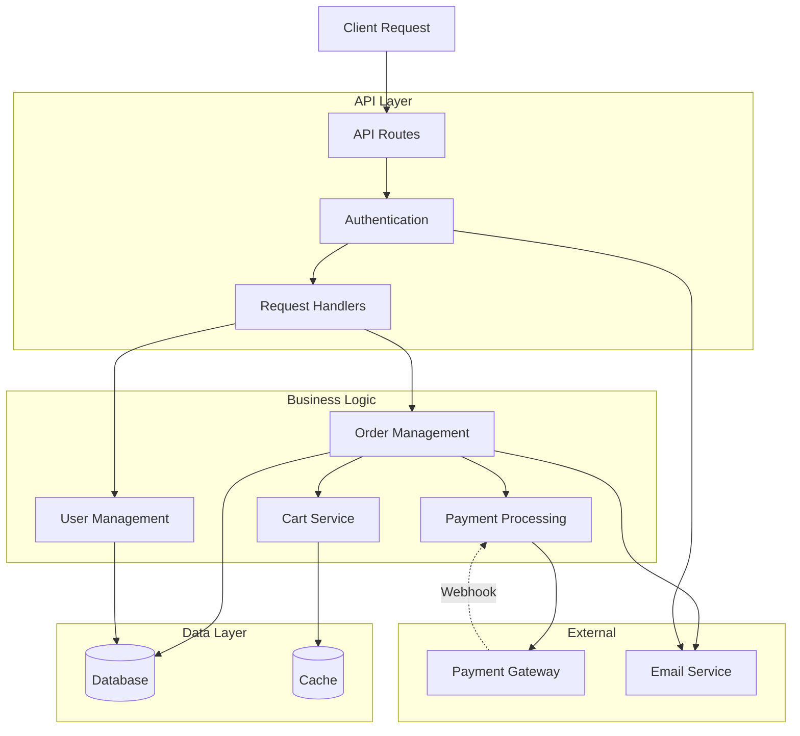

## Overview

The `generate_map` prompt guides AI agents through generating comprehensive architecture documentation for a codebase. It reads the knowledge graph, identifies key structures, and produces documentation with mermaid diagrams.

**Use this to auto-generate `ARCHITECTURE.md`** files for onboarding, documentation, or code reviews.

## Parameters

<ParamField path="repo" type="string">
  Repository name (omit if only one repository is indexed)
  
  Required when multiple repositories are indexed.
</ParamField>

## What It Does

The prompt instructs the agent to:

1. **Read codebase context** to get stats and overview
2. **List all functional areas** (clusters) with cohesion scores
3. **List all execution flows** (processes) with step counts
4. **Trace top 5 processes** to get step-by-step execution details
5. **Generate mermaid diagram** showing architecture and connections
6. **Write ARCHITECTURE.md** with overview, areas, flows, and diagram

## Usage

### In Claude Desktop

```
Run the generate_map prompt
```

Agent will ask for the repo name if multiple are indexed.

### In Cursor/OpenCode

Invoke from the MCP prompts menu:

```
Use the generate_map prompt to document this codebase
```

### With Parameters

```
Run generate_map for repo="frontend"
```

## Example Workflow

Here's what the agent does when you invoke this prompt:

<Steps>
  <Step title="Read Context">
    Reads `gitnexus://repo/{name}/context` to get codebase statistics:
    
    ```yaml
    project: my-app
    stats:
      files: 342
      symbols: 1248
      processes: 87
    ```
  </Step>
  
  <Step title="List Functional Areas">
    Reads `gitnexus://repo/{name}/clusters` to see all modules:
    
    ```yaml
    modules:
      - name: "Authentication"
        symbols: 23
        cohesion: 78%
      - name: "Database"
        symbols: 45
        cohesion: 82%
      - name: "API Routes"
        symbols: 67
        cohesion: 71%
    ```
  </Step>
  
  <Step title="List Execution Flows">
    Reads `gitnexus://repo/{name}/processes` to see all processes:
    
    ```yaml
    processes:
      - name: "User Login Flow"
        type: api
        steps: 12
      - name: "Order Checkout"
        type: api
        steps: 23
    ```
  </Step>
  
  <Step title="Trace Key Processes">
    For the top 5 most important processes, reads detailed traces:
    
    ```
    Read: gitnexus://repo/my-app/process/User Login Flow
    Read: gitnexus://repo/my-app/process/Order Checkout
    Read: gitnexus://repo/my-app/process/Payment Processing
    ```
  </Step>
  
  <Step title="Generate Documentation">
    Creates ARCHITECTURE.md with:
    - Overview section with stats
    - Functional areas description
    - Key execution flows with traces
    - Mermaid architecture diagram
  </Step>
</Steps>

## Example Output

The agent generates a comprehensive ARCHITECTURE.md file:

````markdown
# Architecture Overview

## Codebase Statistics

- **Files**: 342
- **Symbols**: 1,248 (functions, classes, methods)
- **Processes**: 87 execution flows
- **Indexed**: 2024-01-15

## Functional Areas

The codebase is organized into 47 functional areas detected through community analysis:

### Core Modules

#### Authentication (23 symbols, 78% cohesion)
Handles user authentication, session management, and token generation.

Key symbols:
- `login`, `logout`, `validateToken`, `refreshToken`
- `AuthProvider`, `AuthMiddleware`
- `hashPassword`, `comparePasswords`

#### Database (45 symbols, 82% cohesion)
Database access layer with query builders and ORM utilities.

Key symbols:
- `findUserByEmail`, `createUser`, `updateUser`
- `executeQuery`, `transaction`
- `ConnectionPool`, `QueryBuilder`

#### API Routes (67 symbols, 71% cohesion)
HTTP request handlers and routing logic.

Key symbols:
- `loginHandler`, `registerHandler`, `profileHandler`
- `orderHandler`, `checkoutHandler`
- `apiRouter`, `middleware`

### Supporting Modules

#### Payment Processing (28 symbols, 80% cohesion)
Payment gateway integration and transaction handling.

#### User Management (34 symbols, 75% cohesion)
User profile management, permissions, and preferences.

## Key Execution Flows

### User Login Flow (API, 12 steps)

Complete authentication flow from request to response:

1. `loginHandler` (src/routes/auth.ts) — Entry point
2. `validateCredentials` (src/auth/validate.ts) — Input validation
3. `hashPassword` (src/auth/utils.ts) — Password hashing
4. `findUserByEmail` (src/db/users.ts) — Database lookup
5. `comparePasswords` (src/auth/utils.ts) — Password verification
6. `generateToken` (src/auth/tokens.ts) — JWT generation
7. `signJWT` (src/auth/jwt.ts) — Token signing
8. `createSession` (src/db/sessions.ts) — Session creation
9. `insertSession` (src/db/queries.ts) — Database insert
10. `auditLog` (src/logging/audit.ts) — Audit logging
11. `sendWelcomeEmail` (src/email/templates.ts) — Email notification
12. `returnResponse` (src/routes/auth.ts) — HTTP response

### Order Checkout (API, 23 steps)

E-commerce checkout and payment processing flow:

1. `checkoutHandler` (src/routes/orders.ts) — Entry point
2. `validateCart` (src/cart/validate.ts) — Cart validation
3. `calculateTotal` (src/cart/totals.ts) — Price calculation
4. `createOrder` (src/orders/create.ts) — Order creation
5. `processPayment` (src/payments/process.ts) — Payment gateway call
...
23. `sendConfirmationEmail` (src/email/templates.ts) — Order confirmation

### Payment Processing (Event, 15 steps)

Asynchronous payment webhook handler:

1. `webhookHandler` (src/webhooks/payment.ts) — Entry point
2. `verifySignature` (src/webhooks/verify.ts) — Webhook authentication
3. `parsePayload` (src/webhooks/parse.ts) — JSON parsing
...

## Architecture Diagram



## Module Dependencies

### High Cohesion Modules (>80%)
These modules are well-isolated with clear boundaries:
- Database (82%)
- Payment Processing (80%)

### Core Integration Points
- **Authentication** — Used by all API routes
- **Database** — Central data access layer
- **Payment Processing** — Integrated with Orders and Webhooks

## Entry Points

Main application entry points:

1. **API Server** — HTTP request handling (87 processes)
2. **CLI Commands** — Admin tools and scripts (12 processes)
3. **Event Handlers** — Webhooks and async jobs (8 processes)

## Recommendations

1. **High Cohesion**: Database and Payment modules are well-structured
2. **Consider Splitting**: API Routes module (71% cohesion) could be split by domain
3. **Shared Dependencies**: Authentication is heavily used — ensure backward compatibility
````

## When to Use

<CardGroup cols={2}>
  <Card title="New Repository" icon="folder-plus">
    Generate initial architecture documentation
  </Card>
  
  <Card title="Onboarding" icon="user-plus">
    Help new developers understand the codebase
  </Card>
  
  <Card title="Documentation Refresh" icon="rotate">
    Update architecture docs after major changes
  </Card>
  
  <Card title="Code Review" icon="code-pull-request">
    Provide architectural context in PRs
  </Card>
</CardGroup>

## Customization

You can customize the output by asking the agent:

```
Generate architecture map focusing on the authentication system
```

```
Create architecture docs with sequence diagrams instead of component diagrams
```

```
Generate minimal architecture overview (no process traces)
```

## Resources Used

This prompt reads the following resources:

| Resource | Purpose |
|----------|--------|
| `gitnexus://repo/{name}/context` | Codebase stats and overview |
| `gitnexus://repo/{name}/clusters` | Functional areas with cohesion |
| `gitnexus://repo/{name}/processes` | All execution flows |
| `gitnexus://repo/{name}/process/{name}` | Detailed process traces |

No tools are called — this prompt uses only **resources** for a purely read-only workflow.

## Next Steps

<CardGroup cols={2}>
  <Card title="Resources Overview" icon="database" href="/api/resources/overview">
    Learn about all available resources
  </Card>
  <Card title="Detect Impact Prompt" icon="radiation" href="/api/prompts/detect-impact">
    Analyze changes before committing
  </Card>
</CardGroup>