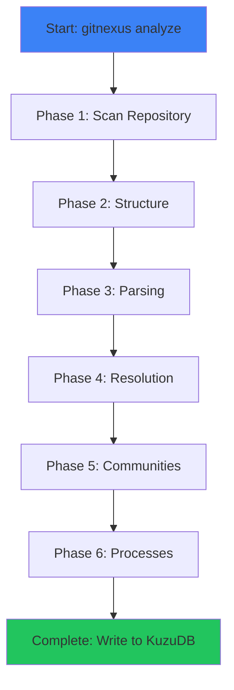

GitNexus indexes your codebase in **6 phases**, extracting structure, parsing code with Tree-sitter, resolving imports and calls, detecting communities, tracing processes, and building search indexes.

## Pipeline Architecture

The pipeline is implemented in `pipeline.ts:27` and runs in-memory with chunked processing for large repositories:



## Phase 1: Scan Repository

**Purpose:** Walk the file tree and collect all file paths with metadata (size).

**Progress:** 0% → 15%

**Implementation:** `filesystem-walker.ts:walkRepositoryPaths()`

- Recursively scans the repository starting from the root
- Filters out `.git`, `node_modules`, `.gitnexus`, and other ignored directories
- Collects file paths and sizes (used for chunking in Phase 3)
- No content is read yet — this is purely a directory walk

```typescript
const scannedFiles = await walkRepositoryPaths(repoPath, (current, total, filePath) => {
  onProgress({
    phase: 'extracting',
    percent: Math.round((current / total) * 15),
    detail: filePath
  });
});
```

<Info>
GitNexus respects `.gitignore` and skips common development directories like `node_modules`, `dist`, `build`, `venv`, etc.
</Info>

## Phase 2: Structure

**Purpose:** Create File and Folder nodes representing the project structure.

**Progress:** 15% → 20%

**Implementation:** `structure-processor.ts:processStructure()`

- Creates `File` nodes for all scanned files
- Creates `Folder` nodes for all directories
- Establishes `CONTAINS` relationships (Folder → File)
- No parsing or content analysis yet

```typescript
processStructure(graph, allPaths);
```

**Output:** File tree structure in the knowledge graph

## Phase 3: Parsing

**Purpose:** Extract symbols (functions, classes, methods, interfaces) using Tree-sitter AST parsing.

**Progress:** 20% → 82%

**Implementation:** `parsing-processor.ts:processParsing()`

### Chunked Processing

To handle large repositories (e.g., Linux kernel with 80K+ files), GitNexus uses **byte-budget chunking**:

- **Chunk size:** 20MB of source code per chunk
- Files are read in chunks to avoid loading the entire codebase into memory
- Each chunk is parsed, processed, and then freed

```typescript title="pipeline.ts:22"
const CHUNK_BYTE_BUDGET = 20 * 1024 * 1024; // 20MB
```

<Note>
**Memory optimization:** 20MB of source code expands to ~200-400MB in memory after AST parsing. Chunking keeps peak memory usage under control.
</Note>

### Tree-sitter Parsing

GitNexus uses **Tree-sitter** for fast, incremental AST parsing:

- **11 languages supported:** TypeScript, JavaScript, Python, Java, C, C++, C#, Go, Rust, PHP, Swift
- **Native bindings (CLI)** or **WASM (Web UI)**
- Worker threads parallelize parsing across CPU cores

```typescript
const chunkWorkerData = await processParsing(
  graph, chunkFiles, symbolTable, astCache,
  onProgress,
  workerPool // Optional: uses workers for parallel parsing
);
```

### Symbol Extraction

For each file, the parser extracts:

- **Functions** (top-level function declarations)
- **Classes** (class definitions)
- **Methods** (functions inside classes)
- **Interfaces** (TypeScript/Java interfaces, Go interfaces)
- **Enums**, **Variables**, **Structs**, **Traits**, etc.

**Output:**
- Symbol nodes in the graph
- Symbol table for lookup during resolution
- AST cache for import/call resolution

## Phase 4: Resolution

**Purpose:** Resolve imports and function calls across files to create `IMPORTS` and `CALLS` edges.

**Progress:** Integrated into Phase 3 (parsed chunk by chunk)

**Implementation:**
- `import-processor.ts:processImports()` — Resolves import statements
- `call-processor.ts:processCalls()` — Resolves function calls
- `heritage-processor.ts:processHeritage()` — Resolves inheritance (`EXTENDS`, `IMPLEMENTS`)

### Import Resolution

<Steps>
  <Step title="Extract import statements">
    Tree-sitter parses import syntax (e.g., `import { X } from './file'`)
  </Step>
  <Step title="Resolve import paths">
    Uses language-specific resolution logic:
    - **TypeScript:** Respects `tsconfig.json` path aliases
    - **Python:** Resolves relative and package imports
    - **Go:** Uses `go.mod` module paths
    - **PHP:** Uses Composer PSR-4 autoloading
    - **Swift:** Uses Swift Package Manager targets
  </Step>
  <Step title="Create IMPORTS edges">
    File → File relationships with confidence 1.0
  </Step>
</Steps>

**Suffix index optimization:** Import resolution uses a pre-built suffix index (e.g., `auth/validate.ts` → all matching files) to speed up fuzzy path matching.

### Call Resolution

Call resolution is more complex because it requires matching **call sites** to **function definitions**:

1. **Find the caller:** Use Tree-sitter to find the enclosing function for each call site
2. **Find the callee:** Look up the called function in the symbol table
3. **Resolve across files:** Use import statements to resolve calls to imported functions
4. **Assign confidence:**
   - Same file: 1.0
   - Import-resolved: 0.85
   - Fuzzy global match: 0.5 or 0.3

```typescript title="call-processor.ts:48"
const findEnclosingFunction = (node, filePath, symbolTable) => {
  let current = node.parent;
  while (current) {
    if (FUNCTION_NODE_TYPES.has(current.type)) {
      // Found the caller function
      return symbolTable.lookupExact(filePath, funcName);
    }
    current = current.parent;
  }
  return null; // Top-level call
};
```

### Heritage Resolution

Finds class inheritance and interface implementation:

- `EXTENDS` edges for class inheritance
- `IMPLEMENTS` edges for interface implementation
- Confidence: 1.0 (these are explicit declarations)

**Output:**
- `IMPORTS`, `CALLS`, `EXTENDS`, `IMPLEMENTS` edges in the graph
- All edges have `confidence` and `reason` properties

## Phase 5: Communities

**Purpose:** Group related symbols into functional clusters using the Leiden algorithm.

**Progress:** 82% → 92%

**Implementation:** `community-processor.ts:processCommunities()`

### Leiden Algorithm

GitNexus uses the **Leiden algorithm** (vendored from graphology) to detect communities:

- **Input:** Graph of symbols connected by `CALLS`, `EXTENDS`, `IMPLEMENTS` edges
- **Output:** Community assignments for each symbol
- **Modularity score:** Measures how well-defined the communities are

```typescript title="community-processor.ts:124"
const details = await leiden.detailed(graph, {
  resolution: isLarge ? 2.0 : 1.0,  // Higher resolution = more granular communities
  maxIterations: isLarge ? 3 : 0     // Limit iterations for large graphs
});
```

<Info>
**Large graph optimization:** For repos with >10K symbols, GitNexus filters out low-confidence edges (< 0.5) and degree-1 nodes before running Leiden to reduce runtime.
</Info>

### Heuristic Labels

Communities are auto-labeled using folder name heuristics:

```typescript title="community-processor.ts:295"
const generateHeuristicLabel = (memberIds, nodePathMap) => {
  // Find most common parent folder
  const folderCounts = new Map();
  memberIds.forEach(nodeId => {
    const parts = nodePathMap.get(nodeId).split('/');
    const folder = parts[parts.length - 2];
    folderCounts.set(folder, (folderCounts.get(folder) || 0) + 1);
  });
  // Return most common folder, capitalized
};
```

Examples: `Authentication`, `Validation`, `Database`, `Api`

### Community Properties

- **cohesion:** Internal edge density (0-1) — what fraction of edges stay within the community
- **symbolCount:** Number of symbols in the community
- **heuristicLabel:** Auto-generated name

**Output:**
- `Community` nodes
- `MEMBER_OF` edges (symbol → community)

## Phase 6: Processes

**Purpose:** Trace execution flows from entry points through call chains.

**Progress:** 92% → 100%

**Implementation:** `process-processor.ts:processProcesses()`

### Entry Point Detection

Processes start from **entry points** — functions that initiate execution flows:

```typescript title="entry-point-scoring.ts"
const calculateEntryPointScore = (name, language, isExported, callerCount, calleeCount) => {
  let score = 0;
  // 1. Call ratio (calls many, called by few)
  const callRatio = calleeCount / Math.max(1, callerCount);
  if (callRatio > 2) score += 50;

  // 2. Export status (public API)
  if (isExported) score += 30;

  // 3. Name patterns (handle*, on*, *Controller, *Handler, main, etc.)
  if (/^(handle|on|process|execute)/i.test(name)) score += 40;

  return score;
};
```

**Framework detection:** Functions with `@Controller`, `@Get`, `@app.route()` decorators get boosted scores.

### Trace Algorithm

From each entry point, GitNexus traces forward using BFS:

1. Start at entry point
2. Follow `CALLS` edges with confidence ≥ 0.5
3. Limit depth to 10 steps (configurable)
4. Limit branching to 4 paths per node (configurable)
5. Stop at terminal nodes (no outgoing calls)

```typescript title="process-processor.ts:337"
const traceFromEntryPoint = (entryId, callsEdges, config) => {
  const queue = [[entryId, [entryId]]];
  const traces = [];

  while (queue.length > 0) {
    const [currentId, path] = queue.shift();
    const callees = callsEdges.get(currentId) || [];

    if (callees.length === 0) {
      traces.push([...path]); // Terminal node
    } else {
      callees.slice(0, config.maxBranching).forEach(calleeId => {
        if (!path.includes(calleeId)) { // Avoid cycles
          queue.push([calleeId, [...path, calleeId]]);
        }
      });
    }
  }
  return traces;
};
```

### Deduplication

Multiple similar traces are deduplicated:

- Remove traces that are subsets of longer traces
- Keep only the longest path per entry→terminal pair

### Process Properties

- **processType:** `intra_community` (single cluster) or `cross_community` (spans multiple clusters)
- **stepCount:** Number of steps in the trace
- **communities:** List of community IDs touched
- **entryPointId / terminalId:** First and last symbols in the chain

**Output:**
- `Process` nodes
- `STEP_IN_PROCESS` edges (symbol → process, with `step` number)

## Search Indexing

**Purpose:** Build full-text search indexes for fast keyword retrieval.

**Implementation:** KuzuDB FTS indexes are created automatically during graph ingestion.

- **File FTS:** Index file paths
- **Function FTS:** Index function names
- **Class FTS:** Index class names
- **Method FTS:** Index method names
- **Interface FTS:** Index interface names

See [Hybrid Search](/concepts/hybrid-search) for details on BM25 + semantic search.

## Output

The final knowledge graph is written to KuzuDB at `.gitnexus/db/` inside your repository.

**Typical statistics for a 1K-file repo:**

- **Nodes:** ~5,000 (files + symbols + communities + processes)
- **Relationships:** ~15,000 (calls + imports + memberships + steps)
- **Communities:** ~20-50 (functional areas)
- **Processes:** ~50-100 (execution flows)

<Info>
**Index freshness:** Run `npx gitnexus analyze` again to update the graph after code changes. Incremental indexing is on the roadmap.
</Info>

## Performance Characteristics

| Repository Size | Files | Symbols | Index Time | Peak Memory |
|----------------|-------|---------|------------|-------------|
| Small          | Under 100  | Under 1K     | 5-10s      | ~200MB      |
| Medium         | 1K    | ~10K    | 30-60s     | ~500MB      |
| Large          | 5K    | ~50K    | 3-5 min    | ~1GB        |
| Very Large     | 20K+  | 200K+   | 10-20 min  | ~2GB        |

<Note>
**Worker parallelism:** Parsing uses worker threads to parallelize across CPU cores. Set `NODE_ENV=development` to see detailed phase logs.
</Note>

## Next Steps

<CardGroup cols={2}>
  <Card title="Knowledge Graph" href="/concepts/knowledge-graph" icon="diagram-project">
    Understand the graph schema and node types
  </Card>
  <Card title="Processes & Flows" href="/concepts/processes-and-flows" icon="diagram-next">
    Learn how execution flows are traced
  </Card>
</CardGroup>