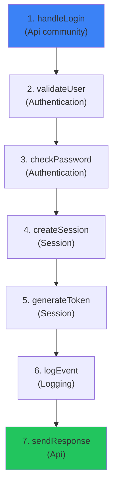

A **Process** in GitNexus represents an execution flow — a traced sequence of function calls from an entry point through the codebase. Processes help AI agents understand **how features work** by showing the actual call chains that implement them.

<Info>
Processes are detected automatically during Phase 6 of indexing, after communities have been identified.
</Info>

## Why Process Detection?

Traditional code search returns individual functions. GitNexus returns **execution flows** — the complete path from entry point to terminal node.

### Without Processes

```
Search: "user login"

Results:
- handleLogin (src/api/auth.ts)
- validateUser (src/services/user.ts)
- createSession (src/services/session.ts)
```

**Problem:** Agent doesn't know these functions are related or in what order they execute.

### With Processes

```
Search: "user login"

Process: LoginFlow (7 steps, cross-community)
  1. handleLogin (Api community)
  2. validateUser (Authentication community)
  3. checkPassword (Authentication community)
  4. createSession (Session community)
  5. generateToken (Session community)
  6. logEvent (Logging community)
  7. sendResponse (Api community)
```

**Result:** Agent sees the complete execution flow and architectural boundaries.

## Entry Point Detection

Processes start from **entry points** — functions that initiate execution flows.

### Entry Point Scoring

GitNexus uses a multi-factor scoring system to identify entry points:

```typescript title="entry-point-scoring.ts"
const calculateEntryPointScore = (name, language, isExported, callerCount, calleeCount, filePath) => {
  let score = 0;
  const reasons = [];

  // 1. Call ratio (calls many, called by few)
  const callRatio = calleeCount / Math.max(1, callerCount);
  if (callRatio > 3) {
    score += 60;
    reasons.push(`call-ratio:${callRatio.toFixed(1)}`);
  } else if (callRatio > 2) {
    score += 40;
  }

  // 2. Export status (public API)
  if (isExported) {
    score += 30;
    reasons.push('exported');
  }

  // 3. Name patterns
  if (/^(handle|on|process|execute)/i.test(name)) {
    score += 40;
    reasons.push('name-pattern:handler');
  }
  if (name === 'main' || name === 'run') {
    score += 50;
    reasons.push('name-pattern:entry');
  }

  // 4. Framework-specific patterns
  if (filePath.includes('controller') || filePath.includes('handler')) {
    score += 20;
    reasons.push('path-pattern:controller');
  }

  return { score, reasons };
};
```

### Framework Detection

Functions with framework decorators get boosted scores:

- **TypeScript:** `@Controller`, `@Get`, `@Post`
- **Python:** `@app.route()`, `@api_view()`
- **Java:** `@RestController`, `@RequestMapping`

```typescript title="process-processor.ts:298"
const astFrameworkMultiplier = node.properties.astFrameworkMultiplier ?? 1.0;
if (astFrameworkMultiplier > 1.0) {
  score *= astFrameworkMultiplier;  // Boost score by 1.5x-3x
  reasons.push(`framework-ast:${node.properties.astFrameworkReason}`);
}
```

### Example Entry Points

<CodeGroup>
```typescript TypeScript
// High-scoring entry points
export async function handleLogin(req: Request) {  // exported + handler pattern
  // ...
}

export class AuthController {  // controller pattern
  @Post('/login')  // framework decorator
  async login() { ... }
}
```

```python Python
@app.route('/login', methods=['POST'])  # framework decorator
def handle_login():  # handler pattern + exported
    # ...
```

```java Java
@RestController  // framework decorator
public class AuthController {
  @PostMapping("/login")  // framework decorator
  public Response handleLogin() {  // handler pattern + public
    // ...
  }
}
```
</CodeGroup>

<Note>
**Test files are excluded** from entry point detection to avoid polluting processes with test-only execution flows.
</Note>

## Trace Algorithm

From each entry point, GitNexus traces forward using **BFS (Breadth-First Search)**:

```typescript title="process-processor.ts:337"
const traceFromEntryPoint = (entryId, callsEdges, config) => {
  const queue = [[entryId, [entryId]]];  // [currentId, pathSoFar]
  const traces = [];

  while (queue.length > 0) {
    const [currentId, path] = queue.shift();
    const callees = callsEdges.get(currentId) || [];

    // Terminal node (no outgoing calls)
    if (callees.length === 0) {
      if (path.length >= config.minSteps) {
        traces.push([...path]);
      }
    }
    // Max depth reached
    else if (path.length >= config.maxTraceDepth) {
      if (path.length >= config.minSteps) {
        traces.push([...path]);
      }
    }
    // Continue tracing
    else {
      const limitedCallees = callees.slice(0, config.maxBranching);
      for (const calleeId of limitedCallees) {
        if (!path.includes(calleeId)) {  // Avoid cycles
          queue.push([calleeId, [...path, calleeId]]);
        }
      }
    }
  }

  return traces;
};
```

### Configuration

```typescript title="process-processor.ts:30"
const DEFAULT_CONFIG = {
  maxTraceDepth: 10,        // Maximum steps in a trace
  maxBranching: 4,          // Max branches to follow per node
  maxProcesses: 75,         // Max processes to detect
  minSteps: 3,              // Minimum steps for a valid process
};
```

<AccordionGroup>
  <Accordion title="maxTraceDepth: 10">
    Limits the depth of tracing to prevent infinite loops and keep processes focused. Most meaningful execution flows complete within 10 steps.
  </Accordion>

  <Accordion title="maxBranching: 4">
    Limits how many outgoing calls to follow from each node. Prevents explosion on utility functions that call dozens of helpers.
  </Accordion>

  <Accordion title="maxProcesses: 75 (dynamic)">
    Total number of processes to detect. Dynamically scaled based on codebase size: `max(20, min(300, symbolCount / 10))`
  </Accordion>

  <Accordion title="minSteps: 3">
    Minimum steps for a valid process. Filters out trivial 2-step flows (A calls B).
  </Accordion>
</AccordionGroup>

### Confidence Filtering

Only edges with confidence ≥ 0.5 are used for tracing:

```typescript title="process-processor.ts:219"
const MIN_TRACE_CONFIDENCE = 0.5;
```

This filters out ambiguous fuzzy-global matches (0.3 confidence) that cause traces to jump across unrelated code.

## Deduplication

Multiple similar traces are deduplicated to avoid redundant processes:

### 1. Subset Removal

Remove traces that are subsets of longer traces:

```typescript title="process-processor.ts:396"
const deduplicateTraces = (traces) => {
  const sorted = traces.sort((a, b) => b.length - a.length);
  const unique = [];

  for (const trace of sorted) {
    const traceKey = trace.join('->');
    const isSubset = unique.some(existing => {
      return existing.join('->').includes(traceKey);
    });
    if (!isSubset) {
      unique.push(trace);
    }
  }
  return unique;
};
```

**Example:**
- Trace 1: `A → B → C → D`
- Trace 2: `A → B → C` ← removed (subset of Trace 1)

### 2. Endpoint Deduplication

Keep only the longest trace per entry→terminal pair:

```typescript title="process-processor.ts:427"
const deduplicateByEndpoints = (traces) => {
  const byEndpoints = new Map();
  const sorted = traces.sort((a, b) => b.length - a.length);

  for (const trace of sorted) {
    const key = `${trace[0]}::${trace[trace.length - 1]}`;
    if (!byEndpoints.has(key)) {
      byEndpoints.set(key, trace);
    }
  }
  return Array.from(byEndpoints.values());
};
```

**Example:**
- Trace 1: `login → validate → checkPassword → createSession` (4 steps)
- Trace 2: `login → validate → createSession` (3 steps) ← removed (same endpoints, shorter)

## Process Types

Processes are classified by community span:

### Intra-Community

All steps stay within a single functional area (community):

```yaml
Process: PasswordValidation
Type: intra_community
Communities: [Authentication]
Steps:
  1. validatePassword
  2. hashPassword
  3. compareHash
```

### Cross-Community

Execution spans multiple functional areas:

```yaml
Process: LoginFlow
Type: cross_community
Communities: [Api, Authentication, Session, Logging]
Steps:
  1. handleLogin (Api)
  2. validateUser (Authentication)
  3. createSession (Session)
  4. logEvent (Logging)
```

<Info>
**Cross-community processes** are often the most architecturally important — they show how different parts of the system interact.
</Info>

## Process Properties

Each `Process` node in the graph has:

| Property | Type | Description |
|----------|------|-------------|
| `heuristicLabel` | string | Auto-generated name: `EntryName → TerminalName` |
| `processType` | enum | `intra_community` or `cross_community` |
| `stepCount` | number | Number of steps in the trace |
| `communities` | string[] | List of community IDs touched |
| `entryPointId` | string | Node ID of the entry point symbol |
| `terminalId` | string | Node ID of the terminal symbol |

### Example Process Node

```json
{
  "id": "proc_42_handlelogin",
  "label": "Process",
  "properties": {
    "name": "HandleLogin → CreateSession",
    "heuristicLabel": "HandleLogin → CreateSession",
    "processType": "cross_community",
    "stepCount": 7,
    "communities": ["comm_1", "comm_3", "comm_5"],
    "entryPointId": "Function:src/api/auth.ts:handleLogin",
    "terminalId": "Function:src/services/session.ts:createSession"
  }
}
```

## STEP_IN_PROCESS Edges

Each symbol in a process has a `STEP_IN_PROCESS` edge with a `step` property:

```cypher
MATCH (fn:Function)-[r:CodeRelation {type: 'STEP_IN_PROCESS'}]->(p:Process)
WHERE p.name = 'LoginFlow'
RETURN fn.name, r.step
ORDER BY r.step
```

**Result:**
```
fn.name          | r.step
-----------------|-------
handleLogin      | 1
validateUser     | 2
checkPassword    | 3
createSession    | 4
generateToken    | 5
logEvent         | 6
sendResponse     | 7
```

## MCP Resources

Processes are exposed via MCP resources for instant context:

### List All Processes

```
gitnexus://repo/{name}/processes
```

**Returns:**
```yaml
processes:
  - name: "HandleLogin → CreateSession"
    type: cross_community
    steps: 7
    communities: [Api, Authentication, Session]
  - name: "ValidatePassword → CompareHash"
    type: intra_community
    steps: 3
    communities: [Authentication]
```

### Get Process Details

```
gitnexus://repo/{name}/process/{processName}
```

**Returns:**
```yaml
process:
  name: "HandleLogin → CreateSession"
  type: cross_community
  step_count: 7
  communities: [Api, Authentication, Session]

steps:
  - step: 1
    symbol: handleLogin
    type: Function
    file: src/api/auth.ts:45
    community: Api
  - step: 2
    symbol: validateUser
    type: Function
    file: src/services/user.ts:12
    community: Authentication
  ...
```

## MCP Context Tool

The `context` tool shows which processes a symbol participates in:

```typescript
context({name: "validateUser"})
```

**Returns:**
```yaml
symbol:
  name: validateUser
  type: Function
  file: src/services/user.ts:12

processes:
  - name: "HandleLogin → CreateSession" (step 2/7)
  - name: "HandleRegister → SendEmail" (step 3/5)
  - name: "ResetPassword → UpdatePassword" (step 1/4)
```

## Example: Login Flow

Here's a real example from a typical web application:



**Process properties:**
- **Type:** `cross_community` (spans 4 communities)
- **Steps:** 7
- **Communities:** Api, Authentication, Session, Logging

**Query to find this process:**

```typescript
query({query: "user login authentication"})
```

**Returns this process as the top result** because it contains symbols that match all query terms.

## Process-Grouped Search

When you use the `query` tool, results are grouped by process:

```typescript
query({query: "authentication"})
```

**Returns:**

```yaml
processes:
  - summary: "HandleLogin → CreateSession"
    priority: 0.042  # Sum of RRF scores / step count
    symbol_count: 7
    process_type: cross_community
    step_count: 7

process_symbols:
  - name: validateUser
    type: Function
    filePath: src/services/user.ts
    process_id: proc_42_handlelogin
    step_index: 2
    relevance: 0.85  # RRF score
  - name: checkPassword
    type: Function
    filePath: src/services/user.ts
    process_id: proc_42_handlelogin
    step_index: 3
    relevance: 0.72
```

<Check>
Process-grouped search gives agents **architectural context** — not just individual functions, but complete execution flows.
</Check>

## Statistics

Typical process counts by repository size:

| Repository Size | Symbols | Processes Detected | Cross-Community |
|----------------|---------|-------------------|------------------|
| Small (under 1K)    | ~500    | 20-30             | ~40%            |
| Medium (1-5K)  | ~5K     | 50-75             | ~50%            |
| Large (10K+)   | ~50K    | 100-200           | ~60%            |

<Info>
Set `NODE_ENV=development` to see detailed process detection logs, including entry point scoring and trace statistics.
</Info>

## Next Steps

<CardGroup cols={2}>
  <Card title="Hybrid Search" href="/concepts/hybrid-search" icon="magnifying-glass">
    Learn how search results are grouped by process
  </Card>
  <Card title="Knowledge Graph" href="/concepts/knowledge-graph" icon="diagram-project">
    Understand the graph schema for processes
  </Card>
</CardGroup>