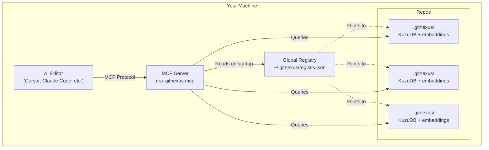

GitNexus supports indexing and querying **multiple repositories** simultaneously. Each repository maintains its own knowledge graph, and the MCP server serves all indexed repos from a global registry.

## How It Works

When you run `gitnexus analyze` in a repository:

1. **Creates local index** in `.gitnexus/` (KuzuDB database, metadata, embeddings)
2. **Registers in global registry** at `~/.gitnexus/registry.json`
3. **Installs project skills** in `.claude/skills/` or `.cursor/skills/`
4. **Creates context files** (`AGENTS.md`, `CLAUDE.md`)

The MCP server (`npx gitnexus mcp`) reads the global registry and serves **all indexed repos** automatically.

## Global Registry

The global registry is a JSON file at `~/.gitnexus/registry.json`:

```json
[
  {
    "name": "backend",
    "path": "/Users/you/projects/backend",
    "storagePath": "/Users/you/projects/backend/.gitnexus",
    "indexedAt": "2026-02-28T10:30:00.000Z",
    "lastCommit": "a1b2c3d",
    "stats": {
      "files": 342,
      "nodes": 1248,
      "edges": 3891,
      "processes": 87,
      "embeddings": 1248
    }
  },
  {
    "name": "frontend",
    "path": "/Users/you/projects/frontend",
    "storagePath": "/Users/you/projects/frontend/.gitnexus",
    "indexedAt": "2026-02-28T11:15:00.000Z",
    "lastCommit": "d4e5f6g",
    "stats": {
      "files": 218,
      "nodes": 856,
      "edges": 2341,
      "processes": 54,
      "embeddings": 856
    }
  }
]
```

### Registry Management

The registry is managed automatically:

- **Add/Update:** `gitnexus analyze` (registers or updates entry)
- **Remove:** `gitnexus clean` (unregisters entry)
- **List:** `gitnexus list` (shows all registered repos)
- **Validate:** Registry validates on MCP server start (removes stale entries)

## Multi-Repo Architecture



<Info>
**Single MCP Server:** One MCP server process serves all indexed repositories. Your editor spawns it once, and it handles routing to the correct repo based on the `repo` parameter.
</Info>

## Using the `repo` Parameter

All GitNexus tools accept an optional `repo` parameter:

```typescript
// Query a specific repo
query({ query: "authentication", repo: "backend" })

// Get context from a specific repo
context({ name: "validateUser", repo: "frontend" })

// Analyze impact in a specific repo
impact({ target: "AuthService", direction: "upstream", repo: "shared" })
```

### When `repo` is Optional

With **only one indexed repo**, the `repo` parameter is optional:

```typescript
// These are equivalent when only one repo is indexed
query({ query: "auth" })
query({ query: "auth", repo: "my-app" })
```

### When `repo` is Required

With **multiple indexed repos**, specify which one:

```typescript
// WRONG - ambiguous
query({ query: "auth" })  // Error: Multiple repos indexed, specify 'repo' parameter

// CORRECT - explicit
query({ query: "auth", repo: "backend" })
```

## Discovering Indexed Repos

Use the `list_repos` tool to see all indexed repositories:

```typescript
list_repos()
```

Returns:

```yaml
repos:
  - name: "backend"
    path: "/Users/you/projects/backend"
    indexed: "2026-02-28T10:30:00.000Z"
    commit: "a1b2c3d"
    files: 342
    symbols: 1248
    processes: 87
  - name: "frontend"
    path: "/Users/you/projects/frontend"
    indexed: "2026-02-28T11:15:00.000Z"
    commit: "d4e5f6g"
    files: 218
    symbols: 856
    processes: 54
```

Or read the repos resource:

```
READ gitnexus://repos
```

<Tip>
**Always start here** when working with multiple repos. This tells you which repos are indexed and what to pass as the `repo` parameter.
</Tip>

## Connection Pooling

The MCP server maintains a **connection pool** for KuzuDB databases:

- **Lazy loading:** Databases are opened on first query
- **Connection reuse:** Subsequent queries reuse existing connections
- **Automatic cleanup:** Connections close on server shutdown

```typescript
// First query to "backend" - opens connection
query({ query: "auth", repo: "backend" })  // ~50ms (connection open)

// Second query to "backend" - reuses connection
query({ query: "user", repo: "backend" })   // ~5ms (connection reused)

// Query to "frontend" - opens new connection
query({ query: "ui", repo: "frontend" })    // ~50ms (connection open)
```

<Note>
Connection pooling is transparent. You don't need to manage connections manually.
</Note>

## Repository Resolution

The MCP server resolves repositories by:

1. **Exact name match:** `repo: "backend"` matches registry entry with name "backend"
2. **Path match:** `repo: "/Users/you/projects/backend"` matches by absolute path
3. **Basename match:** `repo: "backend"` matches `/Users/you/projects/backend`

All three resolve to the same repository:

```typescript
query({ query: "auth", repo: "backend" })
query({ query: "auth", repo: "/Users/you/projects/backend" })
query({ query: "auth", repo: "backend" })  // Same as first
```

## Cross-Repo Queries

To query multiple repos, make separate tool calls:

```typescript
// Find auth code in backend
const backendAuth = query({ query: "authentication", repo: "backend" })

// Find auth code in frontend
const frontendAuth = query({ query: "authentication", repo: "frontend" })

// Compare results
// ...
```

<Warning>
GitNexus does **not** support cross-repo relationship queries. Each repository's knowledge graph is independent. Use separate queries and combine results in your code.
</Warning>

## Repository Naming

Repository names are derived from the directory name:

```bash
/Users/you/projects/backend  → name: "backend"
/Users/you/projects/my-app   → name: "my-app"
/Users/you/monorepo/packages/api → name: "api"
```

### Name Conflicts

If you have two repos with the same directory name:

```bash
/Users/you/work/backend    → name: "backend"
/Users/you/personal/backend → name: "backend"  # Conflict!
```

Use the full path to disambiguate:

```typescript
query({ query: "auth", repo: "/Users/you/work/backend" })
query({ query: "auth", repo: "/Users/you/personal/backend" })
```

## Staleness Checking

Each repository tracks its own staleness:

```typescript
// Read context for a specific repo
READ gitnexus://repo/backend/context
```

Returns:

```yaml
project: backend
staleness: "Index is 3 commits behind. Run: npx gitnexus analyze"
stats:
  files: 342
  symbols: 1248
  processes: 87
```

See [Index Staleness](/concepts/indexing-pipeline) for details.

## Managing Multiple Repos

### List All Repos

```bash
gitnexus list
```

Output:

```
Indexed Repositories
====================

backend
  Path: /Users/you/projects/backend
  Indexed: 2026-02-28T10:30:00.000Z
  Commit: a1b2c3d
  Files: 342 | Symbols: 1248 | Processes: 87

frontend
  Path: /Users/you/projects/frontend
  Indexed: 2026-02-28T11:15:00.000Z
  Commit: d4e5f6g
  Files: 218 | Symbols: 856 | Processes: 54
```

### Re-index a Specific Repo

```bash
cd /path/to/repo
gitnexus analyze
```

This updates both:
- Local index (`.gitnexus/`)
- Global registry entry (`~/.gitnexus/registry.json`)

### Remove a Repo

```bash
cd /path/to/repo
gitnexus clean
```

This removes:
- Local index (`.gitnexus/`)
- Global registry entry

### Remove All Repos

```bash
gitnexus clean --all --force
```

<Warning>
This deletes **all** indexes and clears the global registry. Use with caution.
</Warning>

## Resource URIs with Multi-Repo

All resources use repo-scoped URIs:

```
gitnexus://repos                              # Global: list all repos
gitnexus://repo/backend/context               # Repo-specific
gitnexus://repo/backend/clusters              # Repo-specific
gitnexus://repo/backend/cluster/Auth          # Repo-specific
gitnexus://repo/backend/processes             # Repo-specific
gitnexus://repo/backend/process/LoginFlow     # Repo-specific
gitnexus://repo/backend/schema                # Repo-specific
```

The repo name in the URI matches the registry entry name:

```json
{
  "name": "backend",  // Used in URIs: gitnexus://repo/backend/...
  "path": "/Users/you/projects/backend"
}
```

## Best Practices

### 1. Index Related Repos

Index repositories that work together:

```bash
cd ~/projects/backend && gitnexus analyze
cd ~/projects/frontend && gitnexus analyze
cd ~/projects/shared && gitnexus analyze
```

### 2. Use Consistent Naming

Keep directory names simple and descriptive:

```
✓ backend, frontend, shared
✗ my-awesome-backend-v2-final
```

### 3. Check Staleness Regularly

After pulling changes:

```bash
git pull
gitnexus analyze  # Update index
```

Or read the context resource to check staleness:

```
READ gitnexus://repo/{name}/context
```

### 4. Start with `list_repos`

When working with multiple repos:

```typescript
// 1. Discover repos
list_repos()

// 2. Check context
READ gitnexus://repo/backend/context

// 3. Query specific repo
query({ query: "auth", repo: "backend" })
```

## Troubleshooting

### "Multiple repos indexed" error

When you see this error:

```
Error: Multiple repositories indexed. Please specify 'repo' parameter.
```

Solution:

```typescript
// Add repo parameter
query({ query: "auth", repo: "backend" })
```

### Registry out of sync

If you deleted a repo manually (not via `gitnexus clean`):

```bash
# The MCP server auto-validates on startup
# Or manually clean the registry:
gitnexus list  # Shows all repos, validates registry
```

### Can't find repo by name

If `query({ repo: "myrepo" })` fails:

1. Check registry: `gitnexus list`
2. Verify name matches: `cat ~/.gitnexus/registry.json`
3. Try full path: `query({ repo: "/full/path/to/repo" })`

## Next Steps

<CardGroup cols={2}>
  <Card title="Using the Tools" icon="toolbox" href="/api/tools/query">
    Learn how to use GitNexus tools effectively
  </Card>
  
  <Card title="Index Staleness" icon="clock" href="/concepts/indexing-pipeline">
    Understand when to re-index repositories
  </Card>
  
  <Card title="Resources" icon="database" href="/api/resources/overview">
    Explore MCP resources for structured data
  </Card>
  
  <Card title="CLI Reference" icon="terminal" href="/cli/overview">
    Complete CLI command reference
  </Card>
</CardGroup>