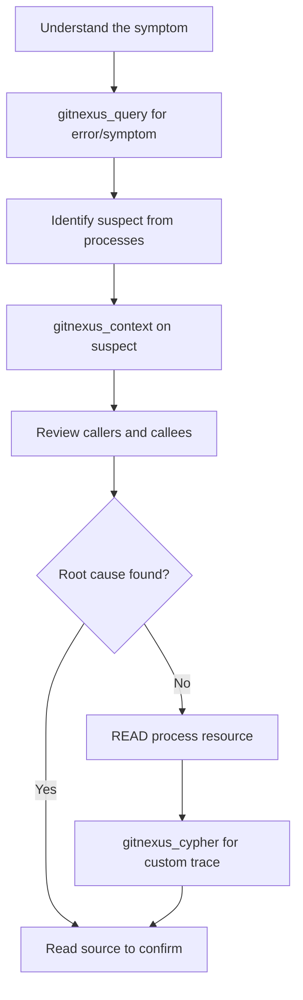

## When to Use This Skill

Use the Debugging skill when you need to:

- Trace where an error originates
- Understand why a function is failing
- Find who calls a problematic method
- Investigate unexpected behavior
- Debug 500 errors or crashes
- Understand intermittent failures

### Example Scenarios

<AccordionGroup>
  <Accordion title="Why is this function failing?">
    Use `gitnexus_context` to see all callers and callees, then check for external dependencies or data flow issues.
  </Accordion>
  <Accordion title="Trace where this error comes from">
    Use `gitnexus_query` with the error message text to find throw sites, then trace backwards through the call chain.
  </Accordion>
  <Accordion title="Who calls this method?">
    Use `gitnexus_context` to get all incoming calls categorized by relationship type (CALLS, IMPORTS).
  </Accordion>
  <Accordion title="This endpoint returns 500">
    Query for the endpoint handler, use context to trace callees, look for external API calls or missing error handling.
  </Accordion>
</AccordionGroup>

## Workflow

Follow these steps for effective debugging:



### Step-by-Step Guide

**1. Understand the Symptom**

Before querying the graph, clearly identify:
- Error message (exact text)
- Unexpected behavior description
- Which endpoint/function exhibits the issue
- When it happens (always? intermittent? specific conditions?)

**2. Query for Related Code**

```javascript
gitnexus_query({query: "payment validation error"})
```

Returns:
- Processes involving this error (e.g., CheckoutFlow, ErrorHandling)
- Symbols related to the error (validatePayment, handlePaymentError, PaymentException)
- Prioritized by relevance

**3. Get Full Context on Suspect**

```javascript
gitnexus_context({name: "validatePayment"})
```

Returns:
- **Incoming calls**: Who triggers this function
- **Outgoing calls**: What this function depends on
- **Processes**: Execution flows involving this symbol

<Tip>
Pay special attention to outgoing calls marked as external APIs—these are common failure points.
</Tip>

**4. Trace Execution Flow**

```
READ gitnexus://repo/{name}/process/CheckoutFlow
```

See exactly where the suspect function appears in the execution chain.

**5. Custom Call Chain Traces (Advanced)**

If you need deeper analysis:

```cypher
MATCH path = (a)-[:CodeRelation {type: 'CALLS'}*1..2]->(b:Function {name: "validatePayment"})
RETURN [n IN nodes(path) | n.name] AS chain
```

This finds all paths leading to the suspect function.

**6. Confirm Root Cause**

Read the source files to verify your hypothesis.

## Checklist

- [ ] Understand the symptom (error message, unexpected behavior)
- [ ] `gitnexus_query` for error text or related code
- [ ] Identify the suspect function from returned processes
- [ ] `gitnexus_context` to see callers and callees
- [ ] Trace execution flow via process resource if applicable
- [ ] `gitnexus_cypher` for custom call chain traces if needed
- [ ] Read source files to confirm root cause

## Debugging Patterns

GitNexus provides different approaches depending on the symptom:

| Symptom | GitNexus Approach | Tools to Use |
|---------|-------------------|-------------|
| **Error message** | Find throw sites, trace backwards | `query` for error text → `context` on throw sites |
| **Wrong return value** | Trace data flow through callees | `context` on the function → examine outgoing calls |
| **Intermittent failure** | Look for external dependencies | `context` → find async calls, external APIs |
| **Performance issue** | Find hot paths (many callers) | `context` → check incoming calls count |
| **Recent regression** | Map what your changes affect | `detect_changes` to see affected processes |

## Tools for Debugging

### gitnexus_query

Find code related to an error:

```javascript
gitnexus_query({query: "payment validation error"})
```

**Returns:**
```javascript
{
  processes: [
    {
      summary: "CheckoutFlow",
      symbols: ["validatePayment", "handlePaymentError"]
    },
    {
      summary: "ErrorHandling",
      symbols: ["PaymentException", "logError"]
    }
  ]
}
```

**Best for:**
- Finding code related to error messages
- Discovering error handling flows
- Locating exception definitions

### gitnexus_context

Get full context on a suspect:

```javascript
gitnexus_context({name: "validatePayment"})
```

**Returns:**
```javascript
{
  symbol: {
    uid: "Function:validatePayment",
    filePath: "src/payments/validator.ts",
    startLine: 42
  },
  incoming: {
    calls: ["processCheckout", "webhookHandler"]
  },
  outgoing: {
    calls: [
      "verifyCard",
      "fetchRates"  // ⚠️ External API call!
    ]
  },
  processes: [
    {
      name: "CheckoutFlow",
      step_index: 3,
      total_steps: 7
    }
  ]
}
```

**Best for:**
- Finding who calls the failing function
- Discovering external dependencies
- Understanding data flow

### gitnexus_cypher

Custom call chain traces:

```cypher
// Find all paths to validatePayment (up to 2 hops)
MATCH path = (a)-[:CodeRelation {type: 'CALLS'}*1..2]->(b:Function {name: "validatePayment"})
RETURN [n IN nodes(path) | n.name] AS chain
```

**Returns:**
```
chains:
  - ["checkoutHandler", "processCheckout", "validatePayment"]
  - ["webhookHandler", "validatePayment"]
  - ["apiMiddleware", "processCheckout", "validatePayment"]
```

**Best for:**
- Complex call chain analysis
- Finding all paths to a function
- Debugging indirect dependencies

<Warning>
Always read `gitnexus://repo/{name}/schema` before writing Cypher queries to understand the graph structure.
</Warning>

## Example: "Payment endpoint returns 500 intermittently"

Here's a complete debugging walkthrough:

### Step 1: Understand the Symptom

- **What**: `/api/checkout` endpoint returns 500
- **When**: Intermittent (not every request)
- **Error**: "Payment validation failed"

### Step 2: Query for Error Handling

```javascript
gitnexus_query({query: "payment error handling"})
```

**Result:**
```
Processes:
  1. CheckoutFlow (7 symbols)
  2. ErrorHandling (4 symbols)

Symbols:
  - validatePayment (src/payments/validator.ts:42)
  - handlePaymentError (src/errors/payment.ts:15)
```

### Step 3: Get Context on validatePayment

```javascript
gitnexus_context({name: "validatePayment"})
```

**Result:**
```
Incoming calls:
  - processCheckout
  - webhookHandler

Outgoing calls:
  - verifyCard
  - fetchRates ← External API! ⚠️

Processes:
  - CheckoutFlow (step 3/7)
```

**Hypothesis**: `fetchRates` is an external API call—might be timing out!

### Step 4: Trace Execution Flow

```
READ gitnexus://repo/my-app/process/CheckoutFlow
```

**Result:**
```
CheckoutFlow:
  1. validateCart
  2. processCheckout
  3. validatePayment
     ↓ calls verifyCard
     ↓ calls fetchRates ← External API
  4. chargeCustomer
  5. saveTransaction
```

### Step 5: Read Source Code

Read `src/payments/validator.ts:42`:

```typescript
async function validatePayment(amount: number) {
  const rates = await fetchRates();  // ⚠️ No timeout!
  // ...
}
```

**Root cause confirmed**: `fetchRates` calls an external API without a proper timeout. When the API is slow, the request hangs and eventually times out with 500.

**Fix**: Add timeout to external API call.

## Advanced Debugging Techniques

### Finding All Error Throw Sites

```cypher
MATCH (f:Function)-[:CodeRelation {type: 'CALLS'}]->(err)
WHERE err.name CONTAINS 'Error' OR err.name CONTAINS 'Exception'
RETURN f.name, f.filePath, err.name
ORDER BY f.filePath
```

### Tracing Data Flow

1. Use `context` to find where data is created (incoming refs)
2. Follow outgoing calls to see transformations
3. Check process trace to see the full pipeline

### Debugging Async Issues

1. `context` to find all async function calls
2. Look for missing `await` or error handling
3. Check for race conditions (multiple callers of same async function)

## Best Practices

<CardGroup cols={2}>
  <Card title="Look for External Calls" icon="globe">
    External APIs are common failure points—check `context` outgoing calls.
  </Card>
  <Card title="Trace Backwards" icon="arrow-left">
    Start at the error, use `context` to find callers, repeat until you reach the entry point.
  </Card>
  <Card title="Check Processes" icon="diagram-project">
    Process traces show the full execution chain—useful for understanding flow.
  </Card>
  <Card title="Use Cypher for Complex Traces" icon="code">
    For multi-hop call chains, write custom Cypher queries.
  </Card>
</CardGroup>

## Common Pitfalls

### Missing Error Handling

```javascript
gitnexus_context({name: "apiCall"})
```

If outgoing calls include external APIs but incoming calls don't show try/catch wrappers, there might be missing error handling.

### Circular Dependencies

```cypher
MATCH path = (a)-[:CodeRelation {type: 'CALLS'}*2..4]->(a)
WHERE a.name = "myFunction"
RETURN path
```

This finds circular call chains that might cause stack overflows.

### Hot Paths

```javascript
gitnexus_context({name: "expensiveFunction"})
```

If incoming calls show many callers, this might be a performance bottleneck.

## Next Steps

<Card title="Learn Impact Analysis" icon="radar" href="/skills/impact-analysis">
  Once you've fixed the bug, use impact analysis to ensure your changes don't break other code
</Card>