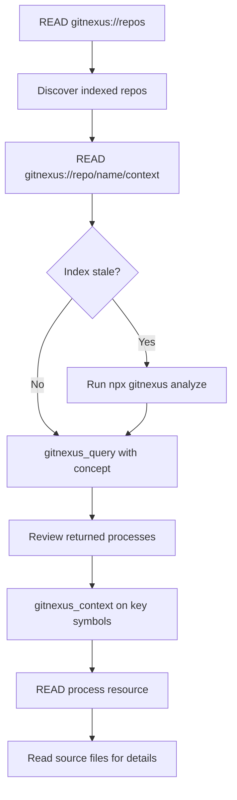

## When to Use This Skill

Use the Exploring skill when you need to:

- Understand how a feature or system works
- Discover the project structure and architecture
- Trace execution flows through the codebase
- Navigate unfamiliar parts of the code
- Answer "How does X work?" questions

### Example Scenarios

<AccordionGroup>
  <Accordion title="How does authentication work?">
    Use `gitnexus_query({query: "authentication"})` to find all auth-related execution flows, then drill down with `gitnexus_context` on specific symbols.
  </Accordion>
  <Accordion title="What's the project structure?">
    Read `gitnexus://repo/{name}/clusters` to see all functional areas with cohesion scores, then explore individual clusters.
  </Accordion>
  <Accordion title="Show me the main components">
    Use `gitnexus_query` with broad terms like "main" or "core", then examine the process-grouped results.
  </Accordion>
  <Accordion title="Where is the database logic?">
    Query for "database" or "db" to find all database-related symbols grouped by execution flow.
  </Accordion>
</AccordionGroup>

## Workflow

Follow these steps for effective code exploration:



### Step-by-Step Guide

**1. Discover Indexed Repositories**

```
READ gitnexus://repos
```

This shows all available indexed repositories. If you're working with multiple repos, identify the one you need.

**2. Get Codebase Overview**

```
READ gitnexus://repo/{name}/context
```

Returns (~150 tokens):
- Number of indexed symbols
- Number of execution flows (processes)
- Index freshness status
- Available tools

<Warning>
If this shows "Index is stale", stop and run `npx gitnexus analyze` in the terminal before continuing.
</Warning>

**3. Query for the Concept**

```javascript
gitnexus_query({query: "payment processing"})
```

Returns process-grouped results:
- **Processes**: Execution flows related to your query (e.g., CheckoutFlow, RefundFlow)
- **Symbols**: Functions/classes grouped by which process they participate in
- **Priorities**: Which processes are most relevant

**4. Deep Dive on Symbols**

```javascript
gitnexus_context({name: "processPayment"})
```

Returns 360-degree view:
- **Incoming calls**: Who calls this function
- **Outgoing calls**: What this function calls
- **Processes**: Which execution flows include this symbol (with step index)
- **File location**: Exact path and line number

**5. Trace Full Execution Flow**

```
READ gitnexus://repo/{name}/process/CheckoutFlow
```

Returns step-by-step trace (~200 tokens):
```
CheckoutFlow (7 steps):
  1. validateCart (src/cart/validator.ts:15)
  2. processPayment (src/payments/processor.ts:42)
  3. validateCard (src/payments/card.ts:28)
  4. chargeStripe (src/payments/stripe.ts:91)
  5. saveTransaction (src/db/transactions.ts:33)
  6. sendConfirmation (src/email/sender.ts:17)
  7. updateInventory (src/inventory/manager.ts:52)
```

**6. Read Source for Implementation**

Now that you know exactly which files matter, read them for implementation details.

## Checklist

Use this checklist to ensure thorough exploration:

- [ ] READ `gitnexus://repo/{name}/context` for overview and staleness check
- [ ] `gitnexus_query` for the concept you want to understand
- [ ] Review returned processes and their priorities
- [ ] `gitnexus_context` on key symbols for callers/callees
- [ ] READ process resource for full execution traces
- [ ] Read source files for implementation details

## Resources Reference

Lightweight reads for navigation (100-500 tokens each):

| Resource | What You Get | Token Cost |
|----------|--------------|------------|
| `gitnexus://repo/{name}/context` | Stats, staleness warning | ~150 |
| `gitnexus://repo/{name}/clusters` | All functional areas with cohesion scores | ~300 |
| `gitnexus://repo/{name}/cluster/{name}` | Area members with file paths | ~500 |
| `gitnexus://repo/{name}/processes` | All execution flows | ~400 |
| `gitnexus://repo/{name}/process/{name}` | Step-by-step execution trace | ~200 |

## Tools for Exploring

### gitnexus_query

Find execution flows related to a concept:

```javascript
gitnexus_query({query: "payment processing"})
```

**Returns:**
```javascript
{
  processes: [
    {
      summary: "CheckoutFlow",
      priority: 0.042,
      symbol_count: 7,
      process_type: "cross_community",
      step_count: 7
    },
    {
      summary: "RefundFlow",
      priority: 0.038,
      symbol_count: 5,
      process_type: "linear",
      step_count: 5
    }
  ],
  process_symbols: [
    {
      name: "processPayment",
      type: "Function",
      filePath: "src/payments/processor.ts",
      process_id: "proc_checkout",
      step_index: 2
    }
  ]
}
```

**Best for:**
- Finding all code related to a feature
- Discovering execution flows you didn't know about
- Understanding which symbols work together

### gitnexus_context

Get 360-degree view of a symbol:

```javascript
gitnexus_context({name: "validateUser"})
```

**Returns:**
```javascript
{
  symbol: {
    uid: "Function:validateUser",
    kind: "Function",
    filePath: "src/auth/validate.ts",
    startLine: 15
  },
  incoming: {
    calls: ["loginHandler", "apiMiddleware"],
    imports: ["authRouter"]
  },
  outgoing: {
    calls: ["checkToken", "getUserById"]
  },
  processes: [
    {
      name: "LoginFlow",
      step_index: 2,
      total_steps: 5
    },
    {
      name: "TokenRefresh",
      step_index: 1,
      total_steps: 3
    }
  ]
}
```

**Best for:**
- Understanding who calls a function
- Finding all dependencies of a symbol
- Seeing which execution flows involve this code

## Example: "How does payment processing work?"

Here's a complete walkthrough:

### Step 1: Get Context

```
READ gitnexus://repo/my-app/context
```

**Result:**
```
Repository: my-app
Symbols: 918
Processes: 45
Status: Fresh (indexed 2 hours ago)
```

### Step 2: Query for Payment Processing

```javascript
gitnexus_query({query: "payment processing"})
```

**Result:**
```
Processes found: 2

1. CheckoutFlow (priority: 0.042, 7 steps)
   - processPayment → validateCard → chargeStripe → saveTransaction

2. RefundFlow (priority: 0.031, 5 steps)
   - initiateRefund → calculateRefund → processRefund → updateBalance
```

### Step 3: Deep Dive on processPayment

```javascript
gitnexus_context({name: "processPayment"})
```

**Result:**
```
Incoming calls:
  - checkoutHandler (src/api/checkout.ts:34)
  - webhookHandler (src/webhooks/stripe.ts:12)

Outgoing calls:
  - validateCard (src/payments/card.ts:28)
  - chargeStripe (src/payments/stripe.ts:91)
  - saveTransaction (src/db/transactions.ts:33)

Processes:
  - CheckoutFlow (step 2/7)
```

### Step 4: Trace Full Flow

```
READ gitnexus://repo/my-app/process/CheckoutFlow
```

**Result:**
```
CheckoutFlow (7 steps):
  1. validateCart
  2. processPayment ← We are here
  3. validateCard
  4. chargeStripe
  5. saveTransaction
  6. sendConfirmation
  7. updateInventory
```

### Step 5: Read Implementation

Now read `src/payments/processor.ts` to see the actual implementation of `processPayment`.

**Complete answer:**

> Payment processing in this codebase follows a 7-step checkout flow:
> 1. Cart validation ensures items are available
> 2. `processPayment` orchestrates the payment (src/payments/processor.ts:42)
> 3. Card details are validated via `validateCard`
> 4. Stripe is charged via `chargeStripe` 
> 5. Transaction is saved to the database
> 6. Confirmation email is sent
> 7. Inventory is updated
>
> The payment can also be triggered via webhook for subscription renewals (webhookHandler).

## Best Practices

<CardGroup cols={2}>
  <Card title="Start Broad, Then Narrow" icon="funnel">
    Use `query` to find related processes, then `context` to drill down on specific symbols.
  </Card>
  <Card title="Trust the Process Groups" icon="layer-group">
    GitNexus groups results by execution flow—this reveals architectural patterns.
  </Card>
  <Card title="Check Index Freshness" icon="clock">
    Always read `context` first to ensure you're working with up-to-date data.
  </Card>
  <Card title="Follow the Trace" icon="route">
    Process resources show you the exact order of execution—follow the steps.
  </Card>
</CardGroup>

## Common Patterns

### Understanding a Feature

```
1. gitnexus_query({query: "feature name"})
2. Review processes to find the main execution flow
3. gitnexus_context on the entry point function
4. READ process resource for full trace
5. Read source files in execution order
```

### Finding Entry Points

```
1. gitnexus_query({query: "main OR entry OR handler"})
2. Look for symbols with many outgoing calls (orchestrators)
3. Check processes to see which are cross_community (span multiple areas)
```

### Understanding Data Flow

```
1. gitnexus_context on the data structure
2. Check incoming refs to see where it's created
3. Check outgoing refs to see where it's used
4. Follow the process trace to see transformations
```

## Next Steps

<Card title="Try Debugging" icon="bug" href="/skills/debugging">
  Once you understand how code works, learn how to trace bugs through it
</Card>