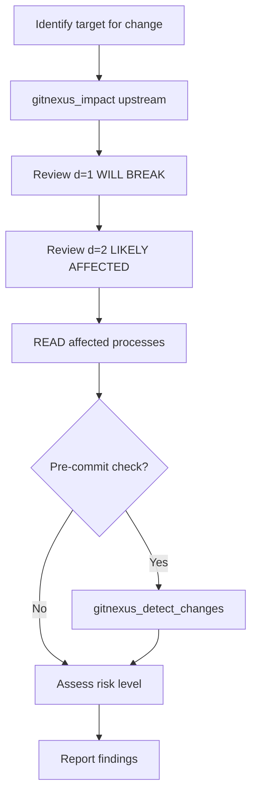

## When to Use This Skill

Use the Impact Analysis skill when you need to:

- Assess safety before changing code
- Understand what depends on a function or class
- Calculate blast radius of a change
- Determine who uses specific code
- Review changes before committing
- Plan refactoring work

### Example Scenarios

<AccordionGroup>
  <Accordion title="Is it safe to change this function?">
    Use `gitnexus_impact({target: "functionName", direction: "upstream"})` to find all dependents at different depths.
  </Accordion>
  <Accordion title="What will break if I modify X?">
    Check d=1 (direct) dependents—these will definitely break. Review d=2 for likely affected code.
  </Accordion>
  <Accordion title="Show me the blast radius">
    Use `impact` with `maxDepth: 3` to see transitive dependencies up to 3 hops away.
  </Accordion>
  <Accordion title="Who uses this code?">
    Use `context` to see incoming references categorized by type (CALLS, IMPORTS, EXTENDS).
  </Accordion>
</AccordionGroup>

## Workflow

Follow these steps for thorough impact analysis:



### Step-by-Step Guide

**1. Analyze Symbol Blast Radius**

```javascript
gitnexus_impact({
  target: "validateUser",
  direction: "upstream",
  minConfidence: 0.8,
  maxDepth: 3
})
```

**Returns depth-grouped dependencies:**
```
TARGET: Function validateUser (src/auth/validate.ts:15)

UPSTREAM (what depends on this):
  Depth 1 (WILL BREAK):
    - loginHandler [CALLS, 100%] → src/auth/login.ts:42
    - apiMiddleware [CALLS, 100%] → src/api/middleware.ts:15
  
  Depth 2 (LIKELY AFFECTED):
    - authRouter [CALLS, 95%] → src/routes/auth.ts:22
    - sessionManager [CALLS, 90%] → src/session/manager.ts:33
```

**2. Check Affected Processes**

```
READ gitnexus://repo/{name}/processes
```

Find which execution flows touch the target symbol:
- LoginFlow
- TokenRefresh
- APIMiddlewarePipeline

**3. Pre-Commit Change Detection**

Before committing, map your git changes to affected processes:

```javascript
gitnexus_detect_changes({scope: "staged"})
```

**Returns:**
```javascript
{
  summary: {
    changed_count: 5,
    affected_count: 3,
    changed_files: 3,
    risk_level: "medium"
  },
  changed_symbols: ["validateUser", "AuthService", ...],
  affected_processes: ["LoginFlow", "TokenRefresh", ...]
}
```

**4. Assess Risk**

Use the decision matrix below to determine risk level.

## Checklist

- [ ] `gitnexus_impact({target, direction: "upstream"})` to find dependents
- [ ] Review d=1 items first (these **WILL BREAK**)
- [ ] Check high-confidence (>0.8) dependencies
- [ ] READ processes to check affected execution flows
- [ ] `gitnexus_detect_changes()` for pre-commit check
- [ ] Assess risk level and report to user

## Understanding Impact Output

### Depth Levels

| Depth | Risk Level | Meaning | Action Required |
|-------|------------|---------|----------------|
| **d=1** | **WILL BREAK** | Direct callers/importers | Must update these |
| **d=2** | LIKELY AFFECTED | Indirect dependencies | Should review these |
| **d=3** | MAY NEED TESTING | Transitive effects | Run tests for these |

### Confidence Scores

GitNexus assigns confidence to each relationship:

- **100%**: Direct static call or import
- **90-99%**: Highly likely (named reference in same module)
- **80-89%**: Probable (string reference or dynamic import)
- **Under 80%**: Filtered out by default (use `minConfidence` to adjust)

### Relationship Types

| Type | Meaning | Example |
|------|---------|----------|
| `CALLS` | Direct function call | `login()` calls `validateUser()` |
| `IMPORTS` | Module import | `import { validateUser } from './auth'` |
| `EXTENDS` | Class inheritance | `class Admin extends User` |
| `IMPLEMENTS` | Interface implementation | `class AuthService implements IAuth` |

## Risk Assessment Matrix

| Affected Symbols | Affected Processes | Risk Level |
|------------------|-------------------|------------|
| Under 5 symbols | 0-1 processes | **LOW** |
| 5-15 symbols | 2-5 processes | **MEDIUM** |
| Over 15 symbols | Over 5 processes | **HIGH** |
| Any in critical path | Auth, payments, core | **CRITICAL** |

<Warning>
Critical paths include:
- Authentication flows
- Payment processing
- Data persistence
- Security middleware
- API gateway functions
</Warning>

## Tools for Impact Analysis

### gitnexus_impact

The primary tool for blast radius analysis:

```javascript
gitnexus_impact({
  target: "validateUser",
  direction: "upstream",      // or "downstream" for dependencies
  minConfidence: 0.8,          // filter low-confidence refs
  maxDepth: 3,                 // how deep to traverse
  relationTypes: ["CALLS"],    // optional: filter by relation type
  includeTests: false          // optional: exclude test files
})
```

**Returns:**
```javascript
{
  target: {
    uid: "Function:validateUser",
    filePath: "src/auth/validate.ts",
    startLine: 15
  },
  upstream: {
    depth_1: [
      {
        symbol: "loginHandler",
        filePath: "src/auth/login.ts",
        line: 42,
        relationType: "CALLS",
        confidence: 1.0
      }
    ],
    depth_2: [...],
    depth_3: [...]
  },
  summary: {
    total_affected: 12,
    by_depth: {d1: 2, d2: 5, d3: 5}
  }
}
```

**Parameters:**
- `direction`: 
  - `"upstream"` → what depends on this (callers)
  - `"downstream"` → what this depends on (callees)
- `maxDepth`: 1-3 recommended (higher = slower + more noise)
- `minConfidence`: 0.8 recommended (lower = more false positives)

### gitnexus_detect_changes

Git-diff based impact analysis:

```javascript
gitnexus_detect_changes({
  scope: "staged"  // or "all" or "unstaged"
})
```

**Returns:**
```javascript
{
  summary: {
    changed_count: 12,        // symbols you modified
    affected_count: 8,        // additional symbols affected
    changed_files: 4,
    risk_level: "medium"      // low/medium/high/critical
  },
  changed_symbols: [
    {
      name: "validateUser",
      filePath: "src/auth/validate.ts",
      changeType: "modified"
    }
  ],
  affected_processes: [
    {
      name: "LoginFlow",
      affected_steps: [2, 3],
      total_steps: 7
    }
  ]
}
```

**Best for:**
- Pre-commit checks
- Understanding scope of current changes
- Identifying affected test suites

### gitnexus_context

For simple "who calls this" queries:

```javascript
gitnexus_context({name: "validateUser"})
```

Use `context` when you need categorized references (calls vs imports vs extends). Use `impact` when you need depth-grouped blast radius.

## Example: "What breaks if I change validateUser?"

Here's a complete impact analysis walkthrough:

### Step 1: Analyze Blast Radius

```javascript
gitnexus_impact({
  target: "validateUser",
  direction: "upstream",
  minConfidence: 0.8,
  maxDepth: 3
})
```

**Result:**
```
TARGET: Function validateUser (src/auth/validate.ts:15)

UPSTREAM DEPENDENCIES:
  Depth 1 (WILL BREAK):
    - loginHandler (src/auth/login.ts:42) [CALLS, 100%]
    - apiMiddleware (src/api/middleware.ts:15) [CALLS, 100%]

  Depth 2 (LIKELY AFFECTED):
    - authRouter (src/routes/auth.ts:22) [CALLS, 95%]
    - sessionManager (src/session/manager.ts:33) [CALLS, 90%]
    - testAuthFlow (tests/auth.test.ts:18) [CALLS, 85%]

  Depth 3 (MAY NEED TESTING):
    - app (src/index.ts:12) [IMPORTS, 80%]

Summary: 6 total dependencies (2 direct, 4 indirect)
```

### Step 2: Check Affected Processes

```
READ gitnexus://repo/my-app/processes
```

**Processes that touch validateUser:**
- LoginFlow (step 2/7)
- TokenRefresh (step 1/3)

### Step 3: Assess Risk

Using the risk matrix:
- **Affected symbols**: 6 (within MEDIUM range)
- **Affected processes**: 2 (within MEDIUM range)
- **Critical path**: Yes (LoginFlow is authentication)

**Risk Level: HIGH** (bumped from MEDIUM due to critical path)

### Step 4: Recommendations

**Report:**

> Changing `validateUser` will affect:
> - **2 direct callers** (loginHandler, apiMiddleware) → will break
> - **2 indirect callers** (authRouter, sessionManager) → likely affected  
> - **2 execution flows** (LoginFlow, TokenRefresh)
> 
> **Risk: HIGH** (authentication is a critical path)
> 
> **Recommended actions:**
> 1. Update loginHandler and apiMiddleware to match new signature
> 2. Review authRouter and sessionManager for compatibility
> 3. Run full auth test suite
> 4. Regression test: LoginFlow and TokenRefresh

## Advanced Techniques

### Finding All Callers Across the Codebase

```cypher
MATCH (caller)-[:CodeRelation {type: 'CALLS'}]->(f:Function {name: "validateUser"})
RETURN caller.name, caller.filePath
ORDER BY caller.filePath
```

### Finding High-Impact Symbols

```cypher
MATCH (f:Function)<-[r:CodeRelation {type: 'CALLS'}]-(caller)
WITH f, COUNT(caller) as callerCount
WHERE callerCount > 10
RETURN f.name, f.filePath, callerCount
ORDER BY callerCount DESC
```

### Comparing Two Symbols

Run `impact` on both and compare the results:

```javascript
const impact1 = gitnexus_impact({target: "funcA", direction: "upstream"})
const impact2 = gitnexus_impact({target: "funcB", direction: "upstream"})

// Compare total_affected to see which has larger blast radius
```

## Best Practices

<CardGroup cols={2}>
  <Card title="Always Check d=1 First" icon="1">
    Depth 1 dependencies **will break**—these are your highest priority.
  </Card>
  <Card title="Use detect_changes Before Commits" icon="git-alt">
    Run pre-commit checks to understand the full scope of your changes.
  </Card>
  <Card title="Watch for Critical Paths" icon="triangle-exclamation">
    Changes to auth, payments, or core systems require extra scrutiny.
  </Card>
  <Card title="Trust Confidence Scores" icon="percent">
    Focus on >80% confidence—lower scores may be false positives.
  </Card>
</CardGroup>

## Pre-Commit Workflow

Before committing changes, follow this workflow:

```bash
# 1. Stage your changes
git add .

# 2. Run impact detection
gitnexus_detect_changes({scope: "staged"})

# 3. Review affected processes and symbols

# 4. Run tests for affected processes
npm test -- LoginFlow TokenRefresh

# 5. Commit if all tests pass
git commit -m "Update validateUser signature"
```

## Common Pitfalls

### Ignoring d=2 Dependencies

Even if d=2 won't immediately break, they're **likely affected**. Always review them.

### Not Checking Processes

A change might affect only 2 symbols but break 5 execution flows—always check processes.

### Trusting Low Confidence

Confidence below 80% may be false positives (string references, dynamic imports). Review carefully.

### Forgetting Test Files

By default, `impact` excludes tests. Use `includeTests: true` if you want to see test dependencies.

## Next Steps

<Card title="Learn Safe Refactoring" icon="code" href="/skills/refactoring">
  Once you understand impact, learn how to safely refactor code with automated rename
</Card>