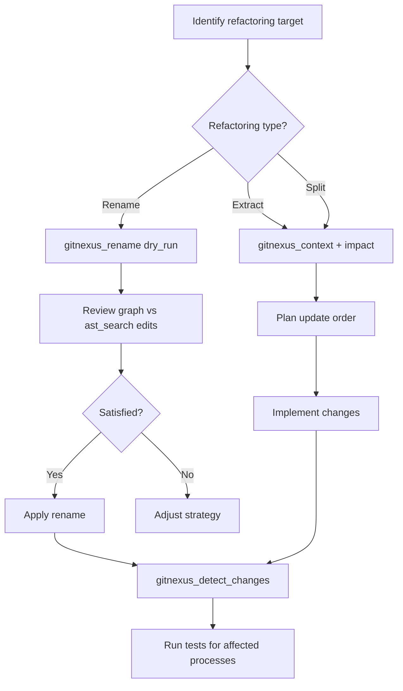

## When to Use This Skill

Use the Refactoring skill when you need to:

- Rename a function or class across multiple files
- Extract code into a separate module
- Split a large service into smaller pieces
- Move code to a different file
- Restructure packages or modules
- Safely modify public APIs

### Example Scenarios

<AccordionGroup>
  <Accordion title="Rename this function safely">
    Use `gitnexus_rename` with `dry_run: true` to preview all edits, then apply if satisfied.
  </Accordion>
  <Accordion title="Extract this into a module">
    Use `gitnexus_context` to see all dependencies, plan the new interface, then extract and update imports.
  </Accordion>
  <Accordion title="Split this service">
    Use `gitnexus_context` to understand callees, group by responsibility, then use `impact` to find all callers to update.
  </Accordion>
  <Accordion title="Move this to a new file">
    Use `impact` to find all dependents, move the code, then update import paths using `rename` or manually.
  </Accordion>
</AccordionGroup>

## Workflow

Follow these steps for safe refactoring:



### General Refactoring Principles

**Update Order:**
1. Interfaces and types first
2. Implementations next
3. Callers after that
4. Tests last

This ensures you're always working with valid code.

## Workflow: Rename Symbol

Renaming is the most common refactoring task. GitNexus provides automated multi-file rename with confidence scoring.

### Step-by-Step Guide

**1. Preview the Rename (Dry Run)**

```javascript
gitnexus_rename({
  symbol_name: "validateUser",
  new_name: "authenticateUser",
  dry_run: true
})
```

**Returns:**
```javascript
{
  status: "success",
  files_affected: 8,
  total_edits: 12,
  graph_edits: 10,        // High confidence (from knowledge graph)
  text_search_edits: 2,    // Review carefully (from AST search)
  changes: [
    {
      file_path: "src/auth/validate.ts",
      edits: [
        {
          line: 15,
          old_text: "function validateUser(",
          new_text: "function authenticateUser(",
          confidence: "graph"  // or "ast_search"
        }
      ]
    },
    {
      file_path: "config/auth.json",
      edits: [
        {
          line: 3,
          old_text: '"handler": "validateUser"',
          new_text: '"handler": "authenticateUser"',
          confidence: "ast_search"  // ⚠️ String reference, review!
        }
      ]
    }
  ]
}
```

**2. Review Edits**

Pay special attention to:
- **graph edits**: High confidence, based on knowledge graph relationships
- **ast_search edits**: Lower confidence, found via text search (might include string refs, comments)

<Warning>
Always review `ast_search` edits manually. These might include:
- String references in config files
- Comments or documentation
- False positives (different symbol with same name)
</Warning>

**3. Apply the Rename**

If satisfied with the preview:

```javascript
gitnexus_rename({
  symbol_name: "validateUser",
  new_name: "authenticateUser",
  dry_run: false
})
```

**4. Verify Changes**

```javascript
gitnexus_detect_changes({scope: "all"})
```

Check that only expected files were modified.

**5. Run Tests**

The `detect_changes` output shows affected processes—run tests for those:

```bash
npm test -- LoginFlow TokenRefresh
```

### Rename Checklist

- [ ] `gitnexus_rename({..., dry_run: true})` to preview all edits
- [ ] Review graph edits (high confidence)
- [ ] **Carefully review ast_search edits** (might include string refs)
- [ ] If satisfied: `gitnexus_rename({..., dry_run: false})` to apply
- [ ] `gitnexus_detect_changes()` to verify scope
- [ ] Run tests for affected processes

## Workflow: Extract Module

Extracting code into a separate module requires understanding dependencies.

### Step-by-Step Guide

**1. Get Full Context**

```javascript
gitnexus_context({name: "processPayment"})
```

**Returns:**
```javascript
{
  incoming: {
    calls: ["checkoutHandler", "webhookHandler"]  // External callers
  },
  outgoing: {
    calls: ["validateCard", "chargeStripe", "saveTransaction"]  // Dependencies
  }
}
```

**2. Map All External Callers**

```javascript
gitnexus_impact({
  target: "processPayment",
  direction: "upstream"
})
```

These are all the places you'll need to update imports.

**3. Define New Module Interface**

Based on incoming calls, design your new module's API:

```typescript
// payments/processor.ts
export async function processPayment(amount: number): Promise<PaymentResult> {
  // Implementation
}
```

**4. Extract Code**

- Create new file
- Move implementation
- Export public interface

**5. Update Imports**

For each caller found in step 2, update the import:

```diff
- import { processPayment } from './checkout'
+ import { processPayment } from './payments/processor'
```

**6. Verify with detect_changes**

```javascript
gitnexus_detect_changes({scope: "all"})
```

Confirm affected scope matches expectations.

**7. Run Tests**

Run tests for all affected processes.

### Extract Module Checklist

- [ ] `gitnexus_context({name: target})` to see all dependencies
- [ ] `gitnexus_impact({target, direction: "upstream"})` to find external callers
- [ ] Define new module interface
- [ ] Extract code and update imports
- [ ] `gitnexus_detect_changes()` to verify scope
- [ ] Run tests for affected processes

## Workflow: Split Function/Service

Splitting a large function or service requires grouping callees by responsibility.

### Step-by-Step Guide

**1. Understand All Callees**

```javascript
gitnexus_context({name: "handleCheckout"})
```

**Returns:**
```javascript
{
  outgoing: {
    calls: [
      "validateCart",      // Validation concern
      "processPayment",    // Payment concern
      "sendEmail",         // Notification concern
      "updateInventory"    // Inventory concern
    ]
  }
}
```

**2. Group Callees by Responsibility**

- **Validation**: validateCart
- **Payment**: processPayment
- **Notification**: sendEmail
- **Inventory**: updateInventory

**3. Map Callers to Update**

```javascript
gitnexus_impact({
  target: "handleCheckout",
  direction: "upstream"
})
```

These are the places that call the monolithic function.

**4. Create New Functions/Services**

```typescript
// Before
async function handleCheckout() {
  validateCart();
  processPayment();
  sendEmail();
  updateInventory();
}

// After
async function validateCheckout() {
  return validateCart();
}

async function executeCheckout() {
  await processPayment();
  await updateInventory();
}

async function notifyCheckout() {
  await sendEmail();
}
```

**5. Update Callers**

For each caller found in step 3, update to use the new functions.

**6. Verify and Test**

Use `detect_changes` and run tests.

### Split Function Checklist

- [ ] `gitnexus_context({name: target})` to understand all callees
- [ ] Group callees by responsibility
- [ ] `gitnexus_impact({target, direction: "upstream"})` to map callers
- [ ] Create new functions/services
- [ ] Update callers
- [ ] `gitnexus_detect_changes()` to verify scope
- [ ] Run tests for affected processes

## Tools for Refactoring

### gitnexus_rename

Automated multi-file rename with confidence scoring:

```javascript
gitnexus_rename({
  symbol_name: "oldName",
  new_name: "newName",
  dry_run: true,           // Preview before applying
  minConfidence: 0.8       // Optional: filter low-confidence edits
})
```

**Returns:**
```javascript
{
  status: "success",
  files_affected: 8,
  total_edits: 12,
  graph_edits: 10,         // From knowledge graph (high confidence)
  text_search_edits: 2,    // From AST search (review carefully)
  changes: [
    {
      file_path: "src/auth/validate.ts",
      edits: [{line, old_text, new_text, confidence}]
    }
  ]
}
```

**Edit Confidence Levels:**
- **graph**: Found via knowledge graph relationships (high confidence)
- **ast_search**: Found via text search (lower confidence, might include string refs)

<Tip>
Always run with `dry_run: true` first to preview changes before applying.
</Tip>

### gitnexus_impact

Map all dependents before refactoring:

```javascript
gitnexus_impact({
  target: "validateUser",
  direction: "upstream"
})
```

Use this to find all callers you'll need to update.

### gitnexus_detect_changes

Verify refactoring scope:

```javascript
gitnexus_detect_changes({scope: "all"})
```

**Returns:**
```javascript
{
  summary: {
    changed_count: 8,
    affected_count: 12,
    changed_files: 5,
    risk_level: "medium"
  },
  changed_symbols: [...],
  affected_processes: ["LoginFlow", "TokenRefresh"]
}
```

Run tests for the affected processes.

### gitnexus_cypher

Custom queries for complex refactoring:

```cypher
// Find all callers across the codebase
MATCH (caller)-[:CodeRelation {type: 'CALLS'}]->(f:Function {name: "validateUser"})
RETURN caller.name, caller.filePath
ORDER BY caller.filePath
```

## Risk Rules

Use these rules to assess refactoring risk:

| Risk Factor | Mitigation Strategy |
|-------------|--------------------|
| **Many callers (>5)** | Use `gitnexus_rename` for automated updates |
| **Cross-area refs** | Use `detect_changes` after to verify scope |
| **String/dynamic refs** | Use `gitnexus_query` to find them, review `ast_search` edits |
| **External/public API** | Version and deprecate properly, coordinate with consumers |

## Example: Rename validateUser to authenticateUser

Here's a complete refactoring walkthrough:

### Step 1: Preview the Rename

```javascript
gitnexus_rename({
  symbol_name: "validateUser",
  new_name: "authenticateUser",
  dry_run: true
})
```

**Result:**
```
Files affected: 8
Total edits: 12

Breakdown:
  - 10 graph edits (high confidence)
  - 2 ast_search edits (review)

Files:
  ✓ src/auth/validate.ts (definition)
  ✓ src/auth/login.ts (caller)
  ✓ src/api/middleware.ts (caller)
  ⚠ config/auth.json (string reference!)
  ...
```

### Step 2: Review ast_search Edits

Check `config/auth.json`:

```json
{
  "handler": "validateUser"  // ← String reference found by ast_search
}
```

This needs to be renamed too—confirms it's a valid edit.

### Step 3: Apply the Rename

```javascript
gitnexus_rename({
  symbol_name: "validateUser",
  new_name: "authenticateUser",
  dry_run: false
})
```

**Result:**
```
✓ Applied 12 edits across 8 files
```

### Step 4: Verify Changes

```javascript
gitnexus_detect_changes({scope: "all"})
```

**Result:**
```
Changed: 12 symbols in 8 files
Affected processes: LoginFlow, TokenRefresh
Risk: MEDIUM
```

### Step 5: Run Tests

```bash
npm test -- LoginFlow TokenRefresh
```

**All tests pass!** Refactoring complete.

## Best Practices

<CardGroup cols={2}>
  <Card title="Always Dry Run First" icon="eye">
    Preview changes with `dry_run: true` before applying any rename.
  </Card>
  <Card title="Review ast_search Edits" icon="magnifying-glass">
    These might include string refs in config files—verify each one.
  </Card>
  <Card title="Use detect_changes After" icon="list-check">
    Verify that only expected files changed and run affected tests.
  </Card>
  <Card title="Update in Order" icon="arrow-down-1-9">
    Interfaces → implementations → callers → tests.
  </Card>
</CardGroup>

## Advanced Techniques

### Renaming Across Multiple Symbols

If you need to rename a pattern (e.g., all `validate*` to `authenticate*`):

1. Find all matching symbols:
   ```cypher
   MATCH (f:Function)
   WHERE f.name STARTS WITH 'validate'
   RETURN f.name
   ```

2. Rename each one with `gitnexus_rename`

3. Use `detect_changes` to verify total scope

### Handling External/Public APIs

For public APIs used by external consumers:

1. **Don't rename immediately**—add new function alongside old
2. Deprecate old function with warnings
3. Update internal callers to use new function
4. Remove old function in next major version

```typescript
// Old (deprecated)
/** @deprecated Use authenticateUser instead */
export function validateUser() {
  return authenticateUser();  // Delegate to new function
}

// New
export function authenticateUser() {
  // Implementation
}
```

### Safe Refactoring Checklist

For any refactoring task:

- [ ] Understand dependencies with `context` and `impact`
- [ ] Plan update order (interfaces first, tests last)
- [ ] Preview changes with dry run (for renames)
- [ ] Make incremental changes
- [ ] Verify scope with `detect_changes`
- [ ] Run tests for affected processes
- [ ] Commit frequently with clear messages

## Common Pitfalls

### Not Previewing Renames

Always use `dry_run: true` first—you might be surprised by string references in config files.

### Ignoring ast_search Edits

These are lower confidence but often valid (config files, JSON, etc.). Review each one.

### Forgetting Tests

Run tests for **affected processes**, not just the changed files. Use `detect_changes` to find them.

### Updating Out of Order

Update interfaces before implementations, otherwise you'll have type errors mid-refactor.

## Next Steps

<CardGroup cols={2}>
  <Card title="Explore Other Skills" icon="compass" href="/skills/overview">
    Return to skills overview to see all available workflows
  </Card>
  <Card title="MCP Tools Reference" icon="toolbox" href="/api/tools/query">
    Learn about all GitNexus MCP tools in detail
  </Card>
</CardGroup>