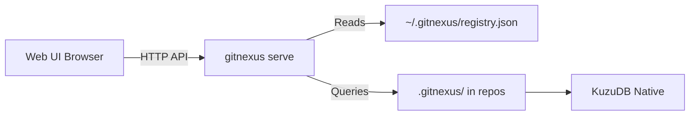
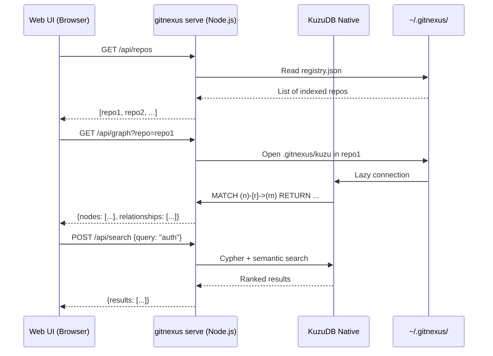

Local backend mode connects the Web UI to the GitNexus CLI's HTTP server, allowing you to explore **CLI-indexed repositories** without re-uploading or re-indexing.

## Why Use Backend Mode?

<CardGroup cols={2}>
  <Card title="No Re-Indexing" icon="clock">
    Browse any CLI-indexed repo instantly — no need to re-upload or re-index
  </Card>
  <Card title="No Size Limits" icon="infinity">
    Bypass browser memory constraints. Explore repos with 100k+ files
  </Card>
  <Card title="Persistent Storage" icon="database">
    CLI indexes are persistent — refresh the page without losing your graph
  </Card>
  <Card title="AI Chat Access" icon="robot">
    Use the Web UI's chat interface with full CLI graph data
  </Card>
</CardGroup>

## How It Works

Backend mode creates a bridge between the Web UI and CLI:



1. **CLI indexes** your repositories locally (persistent storage)
2. **`gitnexus serve`** starts an HTTP server on `localhost:4747`
3. **Web UI auto-detects** the local server and offers to connect
4. **All queries route** through the HTTP API to the native KuzuDB database

<Info>
  The Web UI becomes a **frontend client** for the CLI's graph database. No WASM indexing happens — you're viewing the native CLI index.
</Info>

## Quick Start

<Steps>
  <Step title="Index Your Repo (CLI)">
    First, index your repository with the CLI:
    ```bash
    cd /path/to/your/repo
    npx gitnexus analyze
    ```
    This creates `.gitnexus/` in your repo and registers it globally.
  </Step>
  
  <Step title="Start the Server">
    Launch the HTTP server:
    ```bash
    npx gitnexus serve
    ```
    The server starts at `http://127.0.0.1:4747` by default.
    
    <Accordion title="Custom port or host">
      ```bash
      # Use a different port
      npx gitnexus serve --port 8080
      
      # Bind to all interfaces (warning: allows network access)
      npx gitnexus serve --host 0.0.0.0
      ```
    </Accordion>
  </Step>
  
  <Step title="Open the Web UI">
    Navigate to:
    - [gitnexus.vercel.app](https://gitnexus.vercel.app) (production)
    - `http://localhost:5173` (if running from source)
  </Step>
  
  <Step title="Connect">
    The Web UI will **auto-detect** the local server and show a connection prompt:
    
    > "Local GitNexus server detected. Connect?"
    
    Click **Connect** to load your CLI-indexed repo.
  </Step>
</Steps>

## HTTP API Routes

When connected to the backend, the Web UI uses these API endpoints:

| Endpoint | Method | Purpose |
|----------|--------|----------|
| `/api/repos` | GET | List all indexed repositories |
| `/api/repo` | GET | Get repository metadata |
| `/api/graph` | GET | Download full graph (nodes + edges) |
| `/api/query` | POST | Execute raw Cypher queries |
| `/api/search` | POST | Hybrid search (BM25 + semantic) |
| `/api/file` | GET | Read file content from disk |
| `/api/processes` | GET | List all execution flows |
| `/api/process` | GET | Get process detail with steps |
| `/api/clusters` | GET | List all communities |
| `/api/cluster` | GET | Get community members |

All routes support a `?repo=name` query parameter for multi-repo selection.

## Multi-Repo Support

The server can serve **multiple indexed repositories**:

```bash
# Index multiple projects
cd ~/projects/app-1
npx gitnexus analyze

cd ~/projects/app-2
npx gitnexus analyze

cd ~/projects/lib-1
npx gitnexus analyze

# Start server (serves all three)
npx gitnexus serve
```

In the Web UI:
- The **repo selector** (header dropdown) shows all indexed repos
- Switch between repos without reloading
- Each repo's graph loads on-demand

## Security & CORS

<Warning>
  **Default binding:** The server binds to `127.0.0.1` (localhost only) by default. Only your machine can connect.
</Warning>

**CORS policy:**
- Allows `http://localhost:*` (local dev)
- Allows `http://127.0.0.1:*` (local dev)
- Allows `https://gitnexus.vercel.app` (production Web UI)
- Blocks all other origins

**Path traversal protection:**
- The `/api/file` endpoint validates all paths
- Requests outside the repo root are rejected

**Network exposure:**
If you bind to `0.0.0.0` or a public IP:
- **Anyone on the network can access your code**
- Use this only in trusted networks or behind a firewall
- Consider setting up authentication (not built-in)

## Benefits vs WASM Mode

| Feature | WASM Mode | Backend Mode |
|---------|-----------|---------------|
| **Max repo size** | ~5k files | Unlimited |
| **Indexing speed** | Slow (WASM) | Fast (native) |
| **Persistence** | Session-only | Persistent |
| **Re-index cost** | High (every session) | Low (once via CLI) |
| **Network required** | No | Localhost only |
| **Graph loading** | Immediate | ~1-5s download |

## Auto-Connect URL

Bookmark a direct connection with the `?server` query parameter:

```
https://gitnexus.vercel.app?server=http://localhost:4747
```

The Web UI will:
1. Parse the `?server` param
2. Connect to the backend automatically
3. Load the default repo (first in registry)
4. Remove the query param from the URL (so refresh doesn't re-trigger)

<Tip>
  **Custom server URL:** If you run the server on a different port or host, pass it in the URL:
  ```
  https://gitnexus.vercel.app?server=http://192.168.1.100:8080
  ```
</Tip>

## Embeddings in Backend Mode

**Semantic search** works in backend mode:

- The **CLI** generates embeddings during `gitnexus analyze`
- The **Web UI** uses the server's `/api/search` endpoint
- The backend runs **hybrid search** (BM25 + semantic) server-side

You don't need to wait for browser-based embeddings — search is immediately semantic if the CLI index includes embeddings.

<Accordion title="Skipping embeddings in CLI">
  If you indexed with `--skip-embeddings`, the backend falls back to BM25-only search:
  ```bash
  npx gitnexus analyze --skip-embeddings
  ```
  This is faster but less accurate for semantic queries.
</Accordion>

## AI Chat in Backend Mode

The Web UI's **AI chat** routes all tool calls through the backend:

- `query_code` → `/api/search`
- `run_cypher` → `/api/query`
- `read_file` → `/api/file`
- `get_symbol_references` → Cypher via `/api/query`
- `list_processes` → `/api/processes`

The agent sees the **full CLI-indexed graph** — no memory limits.

## Troubleshooting

<AccordionGroup>
  <Accordion title="Web UI doesn't auto-detect the server">
    - Ensure `gitnexus serve` is running (check terminal output)
    - Verify the server is on `http://localhost:4747` (default)
    - Check browser console for CORS errors
    - Manually enter the server URL in the connection dialog
  </Accordion>
  
  <Accordion title="Connection refused or timeout">
    - Confirm the server is running: `curl http://localhost:4747/api/repos`
    - Check firewall settings (may block local connections)
    - Try `http://127.0.0.1:4747` instead of `localhost`
  </Accordion>
  
  <Accordion title="Empty repo list">
    You haven't indexed any repositories yet:
    ```bash
    cd /path/to/repo
    npx gitnexus analyze
    ```
    Then restart `gitnexus serve`.
  </Accordion>
  
  <Accordion title="Graph loading is slow">
    Large repos take time to serialize and download:
    - **50k nodes:** ~5-10 seconds
    - **100k nodes:** ~20-30 seconds
    
    This is a one-time cost per repo. Subsequent queries are instant.
  </Accordion>
  
  <Accordion title="CORS error from custom domain">
    The server only allows `localhost` and `gitnexus.vercel.app`. If you're hosting the Web UI elsewhere:
    
    1. Fork the CLI repo
    2. Edit `gitnexus/src/server/api.ts` (line 112)
    3. Add your domain to the CORS allowlist
    4. Run from your fork: `npx my-fork serve`
  </Accordion>
</AccordionGroup>

## Architecture Details

### Connection Flow



### KuzuDB Connection Pooling

The server uses a **lazy connection pool** (from `LocalBackend`):

- Connections open **on first query** per repo
- **Max 5 concurrent** connections
- **5-minute TTL** — idle connections close automatically
- Graceful shutdown on `SIGINT`/`SIGTERM`

This allows the server to handle many indexed repos without exhausting file descriptors.

## Next Steps

<CardGroup cols={2}>
  <Card title="CLI Overview" icon="terminal" href="/cli/overview">
    Learn more about CLI indexing and MCP
  </Card>
  <Card title="MCP Integration" icon="plug" href="/mcp/overview">
    Connect AI agents to your indexed repos
  </Card>
</CardGroup>
